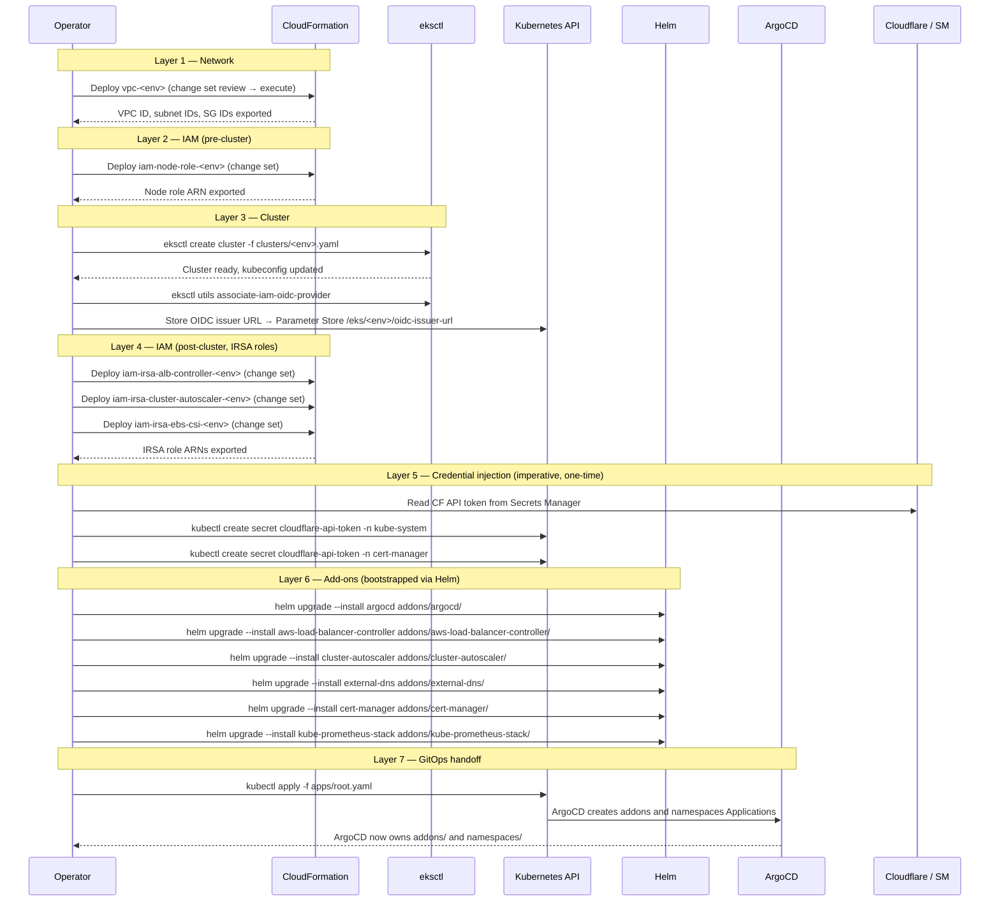

# GitOps and Deployment Model

## Repository Ownership Boundaries

The repository uses three distinct ownership mechanisms. Understanding which system owns which resources determines where a change must be made and how it is applied.

```
eks-infra/
├── vpc/                  ← CloudFormation owns (deployed via change set)
├── iam/                  ← CloudFormation owns (deployed via change set)
├── clusters/             ← eksctl owns (cluster lifecycle operations)
├── addons/               ← ArgoCD owns (manual sync)
├── namespaces/           ← ArgoCD owns (automated sync)
├── apps/                 ← ArgoCD bootstrapping manifests (applied once manually)
├── scripts/              ← Operator tooling (run manually or in CI)
└── docs/                 ← Reference documentation
```

### Ownership summary

| Directory | Owner | How changes apply | Requires approval gate? |
|-----------|-------|-------------------|------------------------|
| `vpc/` | CloudFormation | `aws cloudformation deploy` with change set review | Yes — change set must be reviewed before execution |
| `iam/` | CloudFormation | `aws cloudformation deploy` with change set review | Yes — change set must be reviewed before execution |
| `clusters/` | eksctl | `eksctl create/upgrade/delete` | Yes — manual operator action |
| `addons/` | ArgoCD | Git PR merge → operator triggers manual ArgoCD sync | Yes — ArgoCD diff review before sync |
| `namespaces/` | ArgoCD | Git PR merge → ArgoCD auto-syncs within minutes | PR review only |
| `apps/` | One-time manual `kubectl apply` at bootstrap | N/A after initial bootstrap | |
| `scripts/` | Operators run manually | N/A | Peer review of script changes via PR |

### The bootstrap boundary

There is a one-time bootstrap sequence that is necessarily imperative (before ArgoCD exists to own state). After the bootstrap, all ongoing changes go through git and ArgoCD.

The only permanent imperative exception is the Cloudflare API token injection — this cannot be GitOps-managed because the credential must not exist in the repository.

---

## ArgoCD App of Apps Structure

### `apps/` directory

```
apps/
├── root.yaml          ← Applied once manually; manages addons.yaml and namespaces.yaml
├── addons.yaml        ← ArgoCD Application for addons/ (manual sync)
└── namespaces.yaml    ← ArgoCD Application for namespaces/ (automated sync)
```

### root.yaml (conceptual structure)

```yaml
apiVersion: argoproj.io/v1alpha1
kind: Application
metadata:
  name: root
  namespace: argocd
spec:
  project: default
  source:
    repoURL: <repo-url>
    targetRevision: HEAD
    path: apps
  destination:
    server: https://kubernetes.default.svc
    namespace: argocd
  syncPolicy: {}          # manual — root app is not auto-synced
```

### addons.yaml (conceptual structure)

```yaml
apiVersion: argoproj.io/v1alpha1
kind: Application
metadata:
  name: addons
  namespace: argocd
spec:
  source:
    path: addons
  syncPolicy: {}          # manual sync required
```

### namespaces.yaml (conceptual structure)

```yaml
apiVersion: argoproj.io/v1alpha1
kind: Application
metadata:
  name: namespaces
  namespace: argocd
spec:
  source:
    path: namespaces
  syncPolicy:
    automated:
      prune: true         # remove namespace resources deleted from git
      selfHeal: true      # revert out-of-band changes
```

### Sync policy rationale

| Application | Policy | Rationale |
|-------------|--------|-----------|
| `root` | Manual | The root app rarely changes; human review before syncing |
| `addons` | Manual | Shared services — an unreviewed upgrade affects all tenants |
| `namespaces` | Automated | Low blast radius; PR review is the sufficient gate |

### ArgoCD RBAC

Only the platform team role has the `sync` action on the `addons` Application:

```
p, role:platform-admin, applications, sync, */addons, allow
p, role:platform-admin, applications, sync, */namespaces, allow
p, role:team-lead, applications, get, */*, allow
```

Team leads can inspect sync status and application health but cannot trigger syncs on shared services.

---

## Bootstrap Sequence

The following is the ordered sequence to bring a new cluster environment from zero to a GitOps-managed state. Each step is a discrete, independently verifiable operation.



After Layer 7, the operator's role in day-to-day cluster state management is limited to:
- Reviewing and approving ArgoCD syncs for the `addons` Application.
- Reviewing PRs for `namespaces/` changes (auto-applied by ArgoCD after merge).
- Performing cluster-level operations (eksctl, CFN change sets) for infrastructure changes.

---

## Change Management Policy

### Adding or updating a shared add-on

Changes to `addons/` affect all tenants. The following gate applies:

```
1. Author opens PR with changes to addons/<component>/values.yaml
2. PR reviewed by ≥1 platform team member
       Focus: are pinned versions changing? any new RBAC? any resource limit changes?
3. PR merged to main
4. ArgoCD marks addons Application as OutOfSync — NO automatic apply
5. Platform team reviews ArgoCD diff (rendered Kubernetes resources, not just YAML)
6. Platform team triggers manual sync in ArgoCD UI or via argocd CLI
7. Monitor add-on rollout; verify health checks pass
```

The ArgoCD diff step (5) is essential — it shows the actual Kubernetes resource changes that will be applied, which may differ from the raw Helm values diff due to chart templating.

### Adding a team namespace

Changes to `namespaces/` are automatically applied after PR merge:

```
1. Author (or onboarding script) opens PR adding namespaces/<team-name>/
2. PR reviewed by ≥1 platform team member
       Focus: quota values, RBAC group names, NetworkPolicy correctness
3. PR merged to main
4. ArgoCD auto-syncs — namespace resources applied within minutes
5. Author verifies namespace exists and validate-namespace.py passes
```

### Upgrading Kubernetes version

Kubernetes version upgrades are coordinated operations that span multiple layers:

```
1. Review EKS release notes and add-on compatibility matrix
2. Update clusters/<env>.yaml with new Kubernetes version
3. Run eksctl upgrade cluster (control plane first)
4. Run eksctl upgrade nodegroup for each node group
5. Verify add-on compatibility and upgrade add-ons if required
6. Run validation tests
```

This process is documented in detail in `docs/runbooks/cluster-upgrade.md` (to be authored during implementation).
