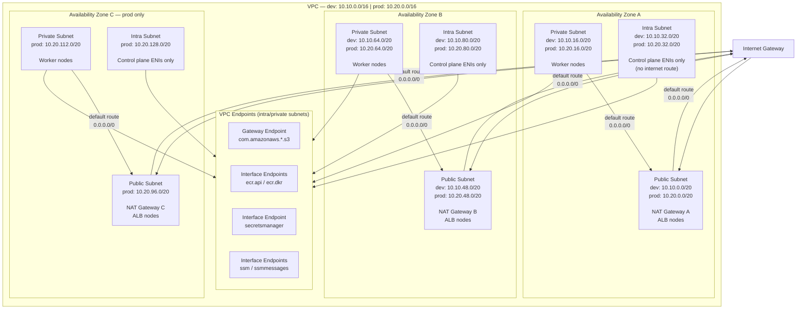
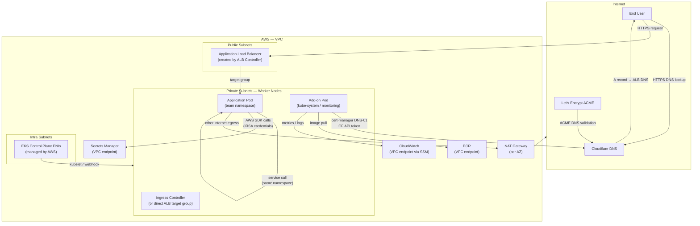
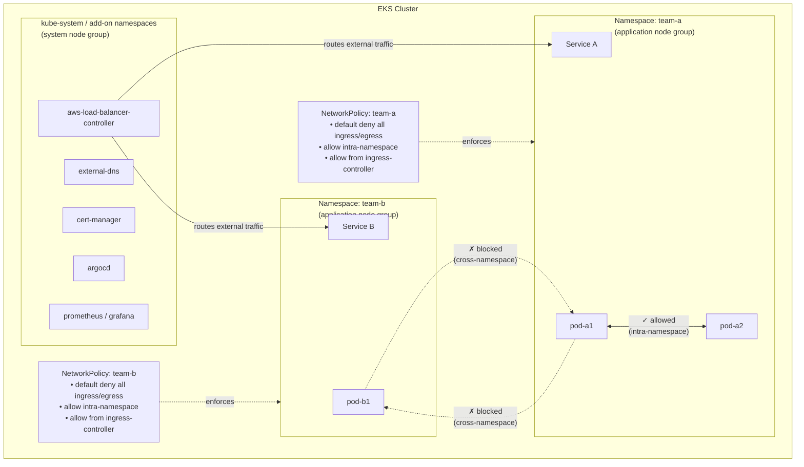

# Network Topology

## VPC Layout

Each environment has a dedicated VPC with three subnet tiers across all Availability Zones. Dev spans 2 AZs; prod spans 3.

### Key routing rules

| Subnet tier | Default route | Purpose |
|-------------|---------------|---------|
| `public` | Internet Gateway | ALBs need direct internet; NAT GW EIPs live here |
| `private` | NAT Gateway (same AZ) | Worker nodes can pull from internet/ECR; no inbound |
| `intra` | None (local only) | Control plane ENIs; no internet reachability |

### Reserved ranges

| CIDR | Status |
|------|--------|
| `10.x.144.0/20` and above | Reserved — future use (peering, expansion, additional node groups) |

---

## Cluster Traffic Flows

---

## Multi-Team Namespace Isolation

### What each team namespace contains

| Resource | Default value | Configurable? |
|----------|--------------|---------------|
| `ResourceQuota` | CPU: 4 cores req / 8 cores limit; Mem: 8Gi req / 16Gi limit | Yes — per team tier |
| `LimitRange` | Container default: 100m CPU req, 500m limit; 128Mi mem req, 512Mi limit | Yes |
| `NetworkPolicy` | Default deny all + intra-namespace allow + ingress-controller allow | Add-only |
| `RoleBinding` (admin) | Group → `admin` ClusterRole in namespace | Yes |
| `RoleBinding` (developer) | Group → custom `developer` Role | Yes |
