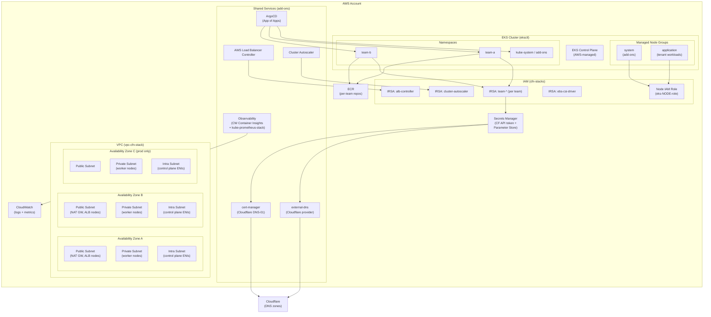
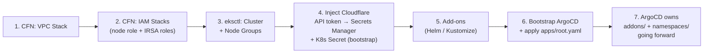
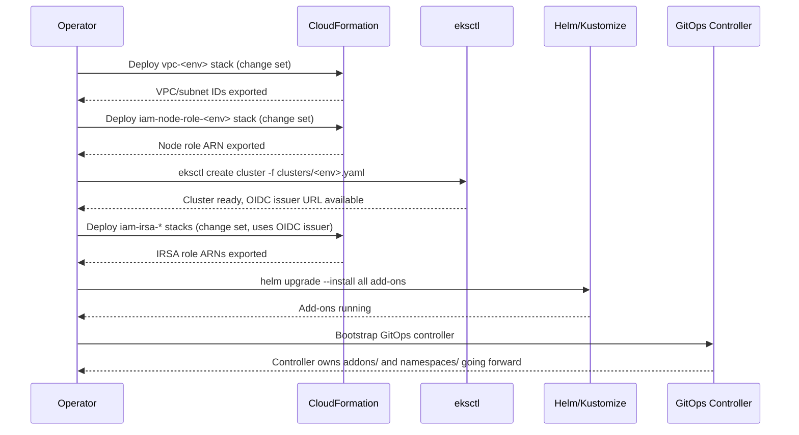

## Context

This is a greenfield build. The repository directories exist but contain no infrastructure code. The target is a shared EKS platform that supports multiple application teams in isolated namespaces, deployed across two environments (`dev` and `prod`). All AWS supporting resources (VPC, IAM) are owned by CloudFormation; cluster lifecycle is owned by eksctl. ArgoCD (App of Apps pattern) reconciles add-on and namespace manifests once the cluster is bootstrapped. DNS and certificate issuance are handled via Cloudflare — no Route 53 dependency.

### Overall Architecture



### Deployment Layer Stack



---

## Goals / Non-Goals

**Goals:**

- Define all IaC for VPC, IAM, cluster, add-ons, and namespace management
- Produce deployable artifacts structured for GitOps reconciliation
- Ensure every component carries only the IAM permissions it requires
- Support independent, incremental deployment of each layer (VPC → IAM → cluster → add-ons → namespaces)

**Non-Goals:**

- Application workload Helm charts (tenant responsibility)
- Multi-region topology
- Service mesh
- Automated cluster version upgrades
- External Secrets Operator integration

---

## Decisions

### D1 — VPC: dedicated per-cluster VPC vs shared VPC

**Decision:** Dedicated VPC per cluster.

**Rationale:** Blast radius isolation — a misconfigured security group or network policy in one cluster cannot affect another. VPC peering can be added later if cross-cluster communication is needed. Shared VPCs introduce IP range coordination complexity across teams.

**Alternative considered:** Shared VPC with subnet-per-cluster — rejected because subnet exhaustion and cross-team blast radius outweigh the cost savings.

---

### D2 — Subnet tiers: public / private / intra

**Decision:** Three subnet tiers per AZ.

```
dev:   10.10.0.0/16
prod:  10.20.0.0/16

Per AZ layout (each tier /20 = ~4000 addresses):
  AZ-a  public  10.x.0.0/20    private  10.x.16.0/20    intra  10.x.32.0/20
  AZ-b  public  10.x.48.0/20   private  10.x.64.0/20    intra  10.x.80.0/20
  AZ-c  public  10.x.96.0/20   private  10.x.112.0/20   intra  10.x.128.0/20
  (10.x.144.0/20 and above reserved for future peering/expansion)
```

**Rationale:** Intra subnets isolate control plane ENIs from pod network traffic, following AWS best practice for large clusters. NAT Gateways per AZ avoid cross-AZ NAT traffic charges and eliminate single-AZ egress dependency.

---

### D3 — Node groups: system vs application split

**Decision:** Two managed node groups — `system` (add-ons) and `application` (tenants).

**Rationale:** Prevents tenant workloads from starving cluster-critical add-ons (autoscaler, ALB controller) of compute. Node selectors/taints keep add-ons scheduled on `system` nodes. Instance families: `m6i`/`m7i` for application, `m6i` for system (smaller, cost-optimized).

**Alternative considered:** Single node group — rejected because a misconfigured tenant resource quota could evict the cluster autoscaler.

---

### D4 — IAM: IRSA for all pod-level AWS access

**Decision:** Every pod that calls AWS APIs does so via IRSA (IAM Roles for Service Accounts). No instance-profile-based pod IAM.

**Rationale:** IRSA scopes permissions to a specific Kubernetes service account, enabling per-pod least-privilege that instance profiles cannot achieve. The node IAM role carries only the minimum permissions required by the node (ECR pull, CloudWatch logs agent, EBS CSI driver bootstrap).

**IRSA trust policy pattern:**
```json
{
  "Effect": "Allow",
  "Principal": { "Federated": "arn:aws:iam::<ACCOUNT>:oidc-provider/<OIDC_ISSUER>" },
  "Action": "sts:AssumeRoleWithWebIdentity",
  "Condition": {
    "StringEquals": {
      "<OIDC_ISSUER>:sub": "system:serviceaccount:<NAMESPACE>:<SA_NAME>",
      "<OIDC_ISSUER>:aud": "sts.amazonaws.com"
    }
  }
}
```

CFN templates parameterise `OIDCIssuer`, `Namespace`, and `ServiceAccountName` so the same template is reused for every IRSA role.

---

### D5 — Add-on delivery: Helm values checked into `addons/`

**Decision:** Each shared add-on has a `values.yaml` (or `values-<env>.yaml`) under `addons/<add-on-name>/`. Deployment is via `helm upgrade --install` for the initial bootstrap (including ArgoCD itself); ArgoCD takes over reconciliation once running.

**Rationale:** Helm values files are reviewable diffs; raw `helm install` commands with `--set` flags are not reproducible. Kustomize overlays are used only where the upstream chart does not support Helm (e.g., cert-manager CRDs via static manifest).

---

### D8 — GitOps: ArgoCD with App of Apps

**Decision:** ArgoCD is the GitOps controller. The repository adds an `apps/` directory containing ArgoCD `Application` manifests. A single root `Application` (`apps/root.yaml`) is applied once manually after ArgoCD is bootstrapped; it then manages all other `Application` manifests.

```
eks-infra/
├── apps/
│   ├── root.yaml          ← bootstrapped manually once
│   ├── addons.yaml        ← Application pointing at addons/
│   └── namespaces.yaml    ← Application pointing at namespaces/
```

**Sync policy per layer:**
- `addons/` — `syncPolicy: {}` (manual sync required; shared services, high blast radius)
- `namespaces/` — `syncPolicy: automated` (low blast radius, safe to auto-apply)

**Alternative considered:** Flux — equally capable, but ArgoCD's UI provides better visibility for a multi-team platform where teams need self-service observability into sync state.

---

### D9 — DNS and certificates: Cloudflare (no Route 53)

**Decision:** Both external-dns and cert-manager use Cloudflare as their provider. No Route 53 hosted zone is created; the Route 53 IRSA role for external-dns is removed entirely.

**Credential injection:** A scoped Cloudflare API token (DNS edit permission on the specific zone only) is stored in AWS Secrets Manager at `/eks/<env>/cloudflare-api-token`. During cluster bootstrap, a one-time imperative step writes it as a Kubernetes `Secret` in the appropriate namespace. The token is never stored in the repository.

```
# bootstrap step (run once after cluster creation)
aws secretsmanager get-secret-value \
  --secret-id /eks/<env>/cloudflare-api-token \
  --query SecretString --output text \
| kubectl create secret generic cloudflare-api-token \
    --from-literal=token=- \
    -n cert-manager
```

**cert-manager ClusterIssuer:**
```yaml
dns01:
  cloudflare:
    email: ops@yourdomain.com
    apiTokenSecretRef:
      name: cloudflare-api-token
      key: token
```

**external-dns values:**
```yaml
provider: cloudflare
env:
  - name: CF_API_TOKEN
    valueFrom:
      secretKeyRef:
        name: cloudflare-api-token
        key: token
```

**Alternative considered:** NS delegation (Cloudflare → Route 53 subdomain) — rejected because it adds a second DNS system with no benefit given that both external-dns and cert-manager have native Cloudflare providers.

---

### D6 — Namespace isolation: NetworkPolicy default-deny

**Decision:** Every team namespace gets a default-deny-all ingress `NetworkPolicy` plus explicit allow rules for intra-namespace traffic and ingress-controller egress.

**Rationale:** Zero-trust within the cluster by default. Teams must explicitly open ports for cross-namespace communication, preventing accidental data leakage between tenants.

---

### D7 — Observability: CloudWatch Container Insights + kube-prometheus-stack

**Decision:** Dual-stack — AWS CloudWatch Container Insights (for AWS-native alarming and cost Explorer correlation) plus `kube-prometheus-stack` (for in-cluster dashboards and team-facing metrics via Grafana).

**Rationale:** CloudWatch is mandatory for AWS support SLAs. Prometheus/Grafana gives teams self-serve dashboards without AWS console access.

---

## Risks / Trade-offs

| Risk | Mitigation |
|------|-----------|
| OIDC issuer URL unavailable until after `eksctl create cluster` | IAM CFN stacks that depend on the OIDC issuer URL are deployed in a second pass after cluster creation; the URL is exported as a Parameter Store value by a post-create script |
| Add-on Helm chart upgrades affect all tenants simultaneously | Pin chart versions in `values.yaml`; upgrade via change set reviewed PR before merging |
| NAT Gateway cost at scale (one per AZ) | Accepted for HA; revisit with VPC endpoints for S3/ECR/Secrets Manager to reduce NAT traffic |
| `eksctl delete cluster` destroys node groups before draining | Document pre-delete drain runbook; enforce via onboarding docs |
| NetworkPolicy default-deny breaks tenant apps that forget to open ports | Provide a validated NetworkPolicy template in the onboarding guide; namespace scaffold includes examples |
| CFN stack drift if operators apply out-of-band changes | Enforce drift detection in CI; no manual console changes policy documented in runbook |
| Cloudflare API token rotation requires re-injecting K8s Secret | Document token rotation runbook; external-dns and cert-manager restart automatically once the Secret is updated |
| ArgoCD `addons/` manual sync could be skipped under pressure | Enforce sync approval in ArgoCD RBAC; only platform team has `applications, sync` permission on the addons Application |

---

## Migration Plan

Because this is greenfield, there is no rollback from an existing state. Deployment is ordered by layer dependency:



**Rollback (pre-GitOps):** Delete add-on Helm releases → `eksctl delete cluster` → delete IAM CFN stacks → delete VPC CFN stack.

---

## Open Questions

All previously open questions are resolved:

| # | Question | Resolution |
|---|---|---|
| 1 | CIDR constraints | No existing VPCs; using `10.10.0.0/16` (dev) and `10.20.0.0/16` (prod) |
| 2 | DNS / hosted zone | Cloudflare owns zones; no Route 53; CF API token injected via Secrets Manager (see D9) |
| 3 | Kubernetes version | Pinned to **1.35** |
| 4 | GitOps controller | **ArgoCD**, App of Apps pattern (see D8) |
| 5 | Prod AZ count | **3 AZs** confirmed |
